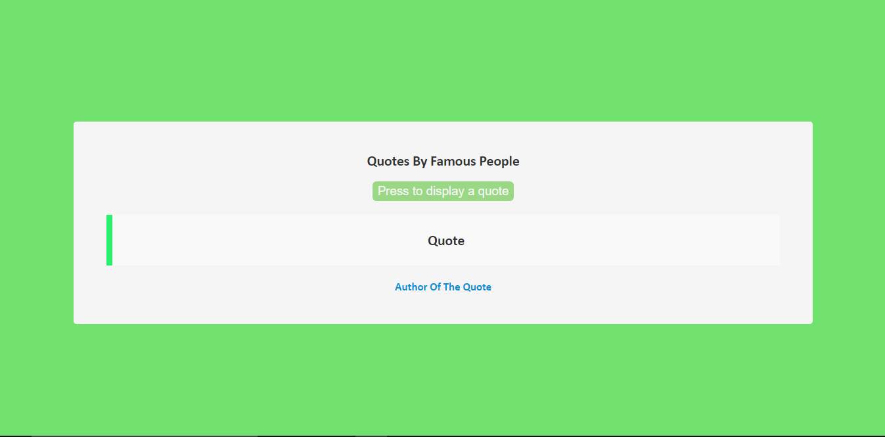

<!-- Please update value in the {}  -->

<h1 align="center">RANDOM-QUOTES</h1>

  <h3>
    <a href="https://randomquotes-app.netlify.app/">
     >> Demo <<
    </a>   
  </h3>

<!-- OVERVIEW -->

## Overview

### About
  This is an image viewer app which shows 6 images in loop with some transitions and moving background.

### Built With

<!-- This section should list any major frameworks that you built your project using. Here are a few examples.-->

- HTML
- CSS
- JavaScript

## Contact

- Website [ScriptoPlankton](https://sandeep.netlify.app/)
- GitHub [@sandeepashok](https://github.com/sandeepashok)

